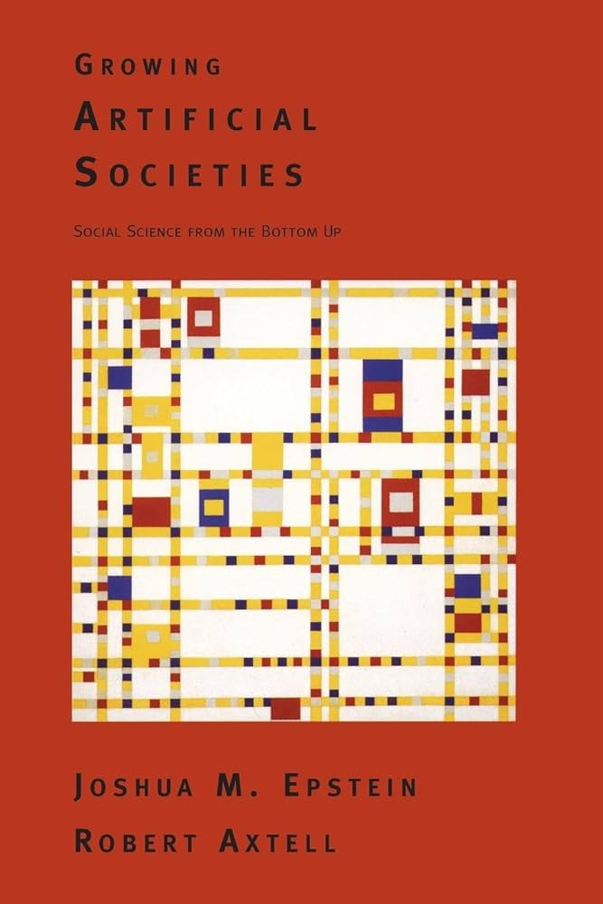
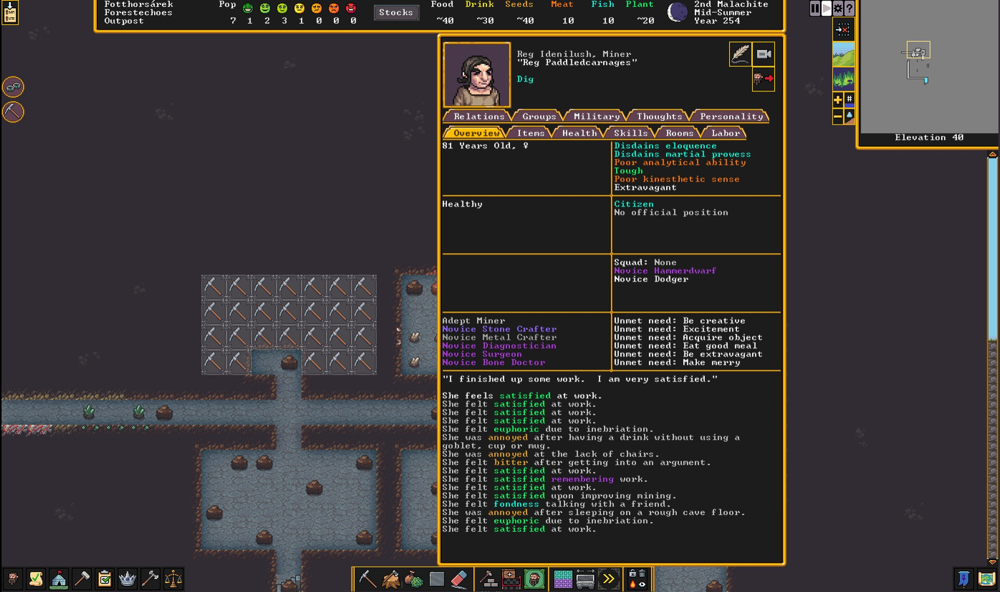
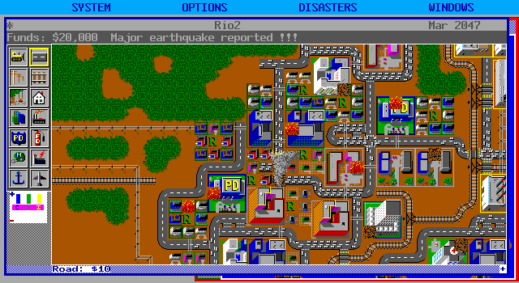
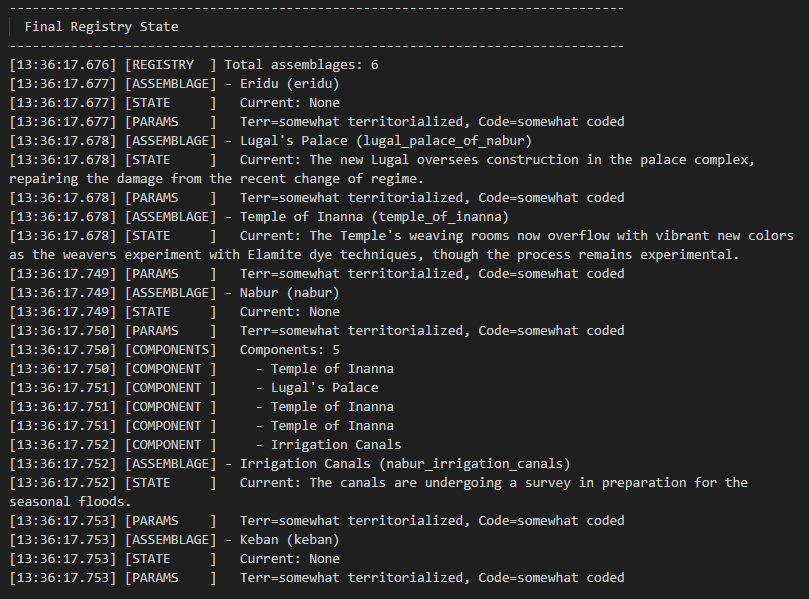

<!-- {"exit": ["burn_to_food"], "color": "emergence"} -->
# Why You Like Emergent Simulation

---
<!-- {"exit": ["burn_to_food"], "color": "emergence"} -->

# Why **I** Like Emergent Simulation

---
<!-- {"exit": ["burn_to_food"], "color": "emergence"} -->
## What is emergent simulation anyway?

---
<!-- {"enter": ["hide_box", "boids_leave", "remove_sugar_agents", "remove_sugar", "remove_slimes", "remove_slime_trails"]} -->

A dynamic simulation with **emergent effects**

- **Simulation**: an imitative representation of a process
- **Dynamic**: the configuration of the system changes over time
- **Emergent**: the complex system has more effects than are obvious from the component parts

---
<!-- {"section": "Examples", "color": "emergence", "enter": ["hide_box", "boids_leave", "remove_sugar_agents", "remove_sugar", "remove_slimes", "remove_slime_trails"]} -->

## Sugarscape

Agent based social simulation

> Epstein, Joshua M., and Robert L. Axtell. Growing Artificial Societies: Social Science from the Bottom Up. Washington, DC; Cambridge, MA: Brookings Institution Press; The MIT Press, 1996.

|||

---
<!-- {"section": "Examples", "color": "emergence", "enter": ["spawn_sugar:40", "show_box"]} -->

## Sugarscape

---
<!-- {"enter": ["boid_rules", "show_box", "spawn_boids:36", "toggle_boid_vectors:off", "remove_sugar_agents", "remove_sugar", "clear_food"]} -->
## Flocking Boids

> Craig W. Reynolds. 1987. Flocks, herds and schools: A distributed behavioral model. In Proceedings of the 14th annual conference on Computer graphics and interactive techniques (SIGGRAPH '87). Association for Computing Machinery, New York, NY, USA, 25–34. https://doi.org/10.1145/37401.37406

|||

<!---->

---
<!-- {"enter": ["boid_rules:alignment", "show_box", "toggle_boid_vectors:flocking"]} -->

## Flocking Boids

* **Alignment**
* *Separation*
* *Cohesion*

---
<!-- {"enter": ["boid_rules:cohesion", "show_box", "toggle_boid_vectors:flocking"]} -->

## Flocking Boids

* *Alignment*
* *Separation*
* **Cohesion**

---
<!-- {"enter": ["boid_rules:separation", "show_box", "toggle_boid_vectors:flocking"]} -->

## Flocking Boids

* *Alignment*
* **Separation**
* *Cohesion*

---
<!-- {"enter": ["boid_rules", "show_box"]} -->

## Flocking Boids

> Craig Reynold's boids site is still there:
> https://www.red3d.com/cwr/boids/

|||

<!---->

---
<!-- {"enter": ["toggle_boid_vectors:off", "boids_leave", "boid_rules", "show_box"], "exit": ["remove_boids"]} -->

## Flocking Boids

---
<!-- {"color": "emergence", "enter": ["toggle_boid_vectors:off", "remove_boids", "hide_box"], "exit": ["remove_boids"]} -->

## Slime Mold

> Jones J. Characteristics of pattern formation and evolution in approximations of Physarum transport networks. Artif Life. 2010 Spring;16(2):127-53. doi: 10.1162/artl.2010.16.2.16202. PMID: 20067403.

|||

---
<!-- {"color": "emergence", "enter": ["toggle_boid_vectors:off", "remove_boids", "spawn_slimes:10", "show_box"]} -->

## Slime Mold

> https://cargocollective.com/sagejenson/physarum

---
<!-- {"color": "emergence", "enter": ["toggle_boid_vectors:off", "boids_leave", "spawn_slimes:170", "show_box"], "exit": ["remove_boids"]} -->

## Slime Mold

> https://cargocollective.com/sagejenson/physarum

---
<!-- {"color": "emergence", "enter": ["toggle_boid_vectors:off", "remove_boids", "spawn_slimes:500", "show_box"], "exit": ["remove_slimes"]} -->

## Slime Mold

> https://cargocollective.com/sagejenson/physarum

---
<!-- {"color": "emergence", "enter": ["hide_box", "remove_boids", "remove_sugar_agents", "remove_sugar", "remove_slimes", "remove_slime_trails"]} -->

## Dwarf Fortress

---
<!-- {"color": "emergence", "enter": ["spawn_boids:6"]} -->

## Emergent Simulations

* Comprehensible: tend to have individual rules that are easy to understand

---
<!-- {"color": "emergence", "enter": ["spawn_boids:12"]} -->

## Emergent Simulations

* Comprehensible: tend to have individual rules that are easy to understand
* Serendipity: but have complex effects that you would never anticipate

---
<!-- {"color": "emergence", "enter": ["spawn_boids:36"], "exit": ["boids_leave"]} -->

## Emergent Simulations: **Comprehensive Serendipity**

* Comprehensible: tend to have individual rules that are easy to understand
* Serendipity: but have complex effects that you would never anticipate

---
<!-- {"section": "Simulations are Abstractions", "color": "abstraction", "enter": ["hide_box", "spawn_slimes:1"]} -->
## Simulations are abstractions

---
<!-- {"section": "Simulations are Abstractions", "color": "abstraction", "enter": ["hide_box", "spawn_slimes:6"]} -->

## Simulations are abstractions

Abstraction: a theoretical or general representation of something. A simulation summarizes the thing it represents.

<!-- Every simulation makes compromises. Sometimes it is to make the modeling tractable. Sometimes it is to make it understandable to humans. -->

<!-- ## Simulations are not the thing they are modeling -->

<!-- And often we don't want them to be. The whole point is to make something safer, or more fun, or to do it more times. -->

---
<!-- {"color": "abstraction", "enter": ["hide_box", "spawn_slimes:18"]} -->

"There is no thing-generator. There is only a thing-aboutness generator. [...] If you give me an algorithm, a sine wave or madlibs or tarot cards or GPT3 or tracery, I will generate a mountain for you."

"Also a tree, a love poem, and the feeling of seeing a seagull very far away."

> Kate Compton. 2022. Personal communication.

<!-- In procedural generation we sometimes make a **teleological distinction** between generators. -->

---
<!-- {"color": "abstraction", "enter": ["hide_box", "spawn_slimes:30"], "exit": ["burn_to_food"]} -->

## Emergent Simulations are their own thing

A city in SimCity only loosely resembles a real city, but it is an exact realization of a SimCity.

|||

<!-- --- -->
<!-- ## Simulations can be used for rhetorical purposes -->

<!-- Simulations can be used to convey a message distinct from being a model of the thing they are ostensibly representing. -->

---
<!-- {"color": "simulation"} -->

## Language as emergent simulation

---
<!-- {"section": "Poetics of Emergent Simulations", "color": "simulation", "enter": ["spawn_sugar:30"]} -->

## Combining simulations

SimCity deliberately combines a top-down System Dynamics simulation with a bottom-up Artificial Life simulation.

|||

<!-- --- -->
<!-- {"color": "simulation"} -->

<!-- ## Operational Logics -->

<!-- A related concept is how different game logics can be associated with meaning; two objects colliding can be deployed to various rhetorical ends. -->

<!-- https://eis.ucsc.edu/analyses-and-approaches/operational-logics/ -->

---
<!-- {"section": "What are the limits?", "color": "rhetoric", "enter": ["spawn_sugar:10"]} -->

## Sometimes things are better when they are not simulated.

The things that make games work often come from the weird friction and bespoke elements. A perfect clockwork mechanism has no room for interesting play.

<!-- When we consider an interactive narrative work, the author has often pre-written a lot of the narrative. But this isn't a bad thing. -->

<!-- Building an entire system for a one-off effect isn't particularly efficient when we can instead build a narrative content delivery system. -->

<!-- Even so, we might be tempted to pile simulation on top of simulation, but the danger is that stacking simulations leads to **abstraction decay**. -->

---
<!-- {"color": "rhetoric", "enter": ["spawn_predators:6:sugar"]} -->

## Abstraction Decay

<!-- Remember, each of these simulations is an abstraction, a metaphor with a list of assumptions. -->

<!-- Building a metaphor on top of a metaphor on top of a metaphor can lead to some pretty dubious rhetoric. -->

<!-- Now, there's often a lot of fun to be had with pushing games at precisely this point: seeing where the abstractions break down in funny ways. -->

---

<!-- {"color": "simulation", "enter": ["spawn_predators:6:sugar:slime", "show_box"], "exit": ["hide_box"]} -->

## Sandboxlets.

---
<!-- {"color": "simulation", "enter": ["hide_box", "spawn_boids:6", "spawn_slimes:170", "spawn_sugar:30"], "exit": ["remove_sugar", "burn_to_food"]} -->

## Why does **Dwarf Fortress** get away with being so complicated?

<!-- Dwarf Fortress builds systems on top of systems. The reason why it works is that it leans into the systems. -->

<!-- So we can deal with too many simulations by isolating them into sandboxes. Or we can be like Dwarf Fortress and lean into it. -->

<!-- But mostly you want to be open to the idea that some things don't need to be emergent simulations. -->

---
<!-- {"color": "emergence", "enter": ["hide_box", "remove_predators", "remove_boids", "remove_slimes", "remove_sugar_agents"]} -->

# Why I Like Emergent Simulations

* Comprehensible Serendipity
* They're interesting in themselves
* They can be applied as symbols
* A metaphor that escaped containment

---
<!-- {"color": "emergence", "enter": ["hide_box"]} -->

# Why **You** Like Emergent Simulations

* Comprehensible Serendipity
* They're interesting in themselves
* They can be applied as symbols
* A metaphor that escaped containment

---
<!-- {"jitter": true, "section": "Conclusion", "color": "emergence", "enter": ["spawn_boids:20"], "exit": ["burn_slide_pixels"]} -->

## Simulation starts as metaphor

---
<!-- {"jitter": true, "color": "emergence", "enter": ["spawn_boids:10", "spawn_slimes:70"], "exit": ["burn_slide_pixels"]} -->

## Pushes through the metaphor

---
<!-- {"jitter": true, "color": "emergence", "enter": ["drop_border", "spawn_slimes:70"], "exit": ["burn_slide_pixels"]} -->

## Embrace escaping the metaphor

---
<!-- {"jitter": true, "color": "emergence", "enter": ["spawn_sugar:36"], "exit": ["burn_slide_pixels"]} -->

## Interesting Emergent Simulation is metaphor taken too far

---
## Isaac Karth

Presenting at UC Davis, June 6 2026

isaackarth.com
@procgen.bsky.social

